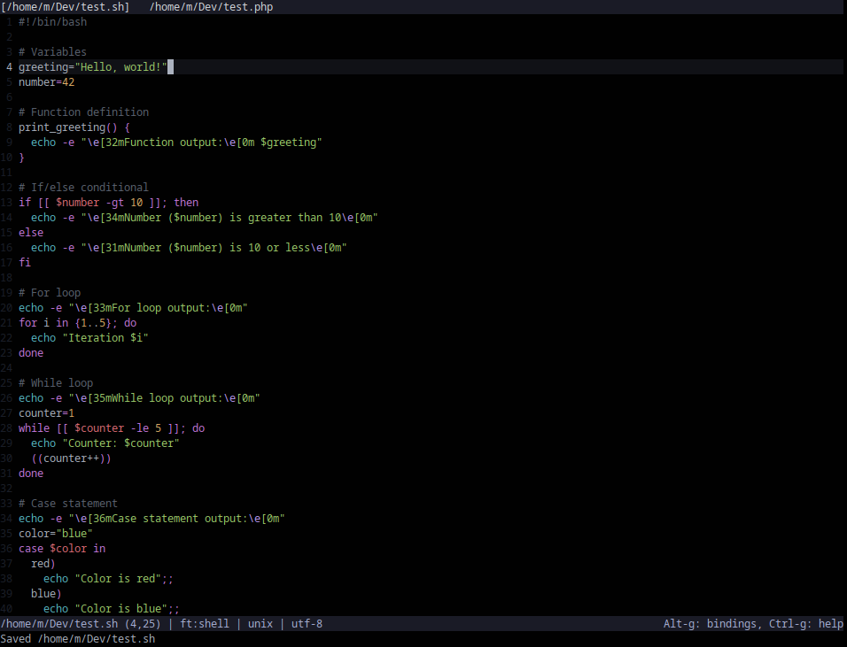

# one-true-dark.micro
A basic Micro editor colorscheme with a clean, dark aesthetic. Designed for readability, simplicity with subtle contrast. Inspired by Atom/Pulsar One Dark theme.



---

## Requirements
TrueColor support must be enabled to render the full color palette accurately.
```
export MICRO_TRUECOLOR=1
```

## Installation
```
mkdir -p ~/.config/micro/colorschemes
cp one-true-dark.micro ~/.config/micro/colorschemes/
```

## Activation
```
set colorscheme one-true-dark
```